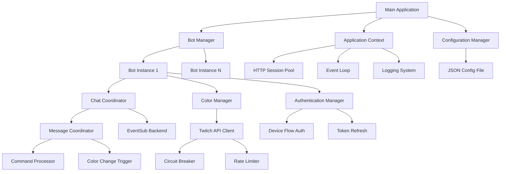

# Twitch ColorChanger Architecture

## Overview

The Twitch ColorChanger is a resilient, multi-user bot application designed to automatically change chat colors after each message sent by the bot's own account. The architecture emphasizes reliability, simplicity, and the ability to run unattended for extended periods.

## Core Principles

- **Reliability First**: Designed to run for weeks/months without intervention
- **Resilience**: Comprehensive error handling, automatic recovery, and graceful degradation
- **Simplicity**: Avoid over-engineering; focus on core functionality
- **Modularity**: Clear separation of concerns with minimal coupling

## High-Level Architecture

## Component Descriptions

### Main Application
- **Purpose**: Application entry point and lifecycle management
- **Responsibilities**:
  - Initialize application context
  - Load and validate configuration
  - Start bot manager
  - Handle graceful shutdown
- **Reliability**: Catches unhandled exceptions, ensures clean shutdown

### Application Context
- **Purpose**: Shared resources and global state
- **Responsibilities**:
  - HTTP session pool for API calls
  - Async event loop management
  - Centralized logging configuration
  - Resource cleanup coordination
- **Reliability**: Ensures proper resource management across all components

### Configuration Manager
- **Purpose**: Configuration file handling
- **Responsibilities**:
  - Load JSON configuration with validation
  - Normalize channel names and deduplication
  - Persist runtime changes (enable/disable state)
  - Handle configuration errors gracefully
- **Reliability**: Validates all inputs, provides clear error messages

### Bot Manager
- **Purpose**: Multi-user bot orchestration
- **Responsibilities**:
  - Create and manage individual bot instances
  - Coordinate startup and shutdown sequences
  - Monitor bot health and restart failed instances
  - Share application context efficiently
- **Reliability**: Independent bot operation, isolated failures

### Bot
- **Purpose**: Individual user/bot lifecycle
- **Responsibilities**:
  - Encapsulate user-specific configuration
  - Coordinate authentication, chat, and color management
  - Handle bot-specific error recovery
- **Reliability**: Self-contained, can restart independently

### Authentication Manager
- **Purpose**: OAuth token lifecycle
- **Responsibilities**:
  - Device authorization flow for initial setup
  - Automatic token refresh (1 hour before expiry)
  - Secure token storage in configuration
- **Reliability**: Proactive refresh prevents authentication failures

### Chat Coordinator
- **Purpose**: EventSub WebSocket management
- **Responsibilities**:
  - Establish and maintain WebSocket connections
  - Manage subscriptions for message events
  - Handle reconnection with exponential backoff
  - Route messages to message coordinator
- **Reliability**: Persistent connections, automatic reconnection

### Message Coordinator
- **Purpose**: Chat message processing
- **Responsibilities**:
  - Filter messages from bot's own account
  - Process commands (cce, ccd, ccc)
  - Trigger automatic color changes
  - Log all message activity
- **Reliability**: Command validation, silent error handling

### Color Manager
- **Purpose**: Color selection and API integration
- **Responsibilities**:
  - Generate random colors (HSL algorithm)
  - Handle preset vs hex color logic
  - Call Twitch Helix API for color changes
  - Implement exclusion logic to avoid repetition
- **Reliability**: Fallback strategies, API error handling

### Utils
- **Circuit Breaker**: Prevents cascading failures on API calls
- **Reconnection Coordinator**: Manages WebSocket reconnection logic
- **Subscription Manager**: Handles EventSub subscription lifecycle

## Data Flow

1. **Startup**:
   - Main → Config Manager → Load config
   - Main → Bot Manager → Create bots
   - Bot → Auth Manager → Ensure valid tokens
   - Bot → Chat Coordinator → Establish WebSocket
   - Bot → Message Coordinator → Start monitoring

2. **Message Processing**:
   - EventSub → Chat Coordinator → Message Coordinator
   - Message Coordinator → Parse commands or trigger color change
   - Color Manager → Select color → API call → Success/Error handling

3. **Error Recovery**:
   - Any component failure → Log → Retry/Recovery strategy
   - Circuit breaker → Open on repeated failures → Automatic reset

## Design Decisions

### Async/Await Architecture
- **Rationale**: Non-blocking I/O for reliability and performance
- **Benefit**: Handles multiple bots efficiently without thread contention

### Shared HTTP Sessions
- **Rationale**: Connection pooling reduces overhead
- **Benefit**: Efficient API calls, better resource utilization

### Configuration-Driven Behavior
- **Rationale**: Runtime changes without restart
- **Benefit**: Flexibility for long-running operation

### Exponential Backoff
- **Rationale**: Prevents thundering herd on failures
- **Benefit**: Gradual recovery, reduced API load

### Circuit Breaker Pattern
- **Rationale**: Fail fast on persistent issues
- **Benefit**: Prevents resource exhaustion, enables partial degradation

### Single Responsibility Principle
- **Rationale**: Each component has one clear purpose
- **Benefit**: Easier testing, maintenance, and debugging

## Reliability Features

- **Automatic Reconnection**: WebSocket connections recover from network issues
- **Token Refresh**: Proactive authentication maintenance
- **Core Function Integrity**: No graceful degradation for message reading or color changing - these are critical functions that must work or fail hard
- **Fallback Strategies**: Hex color fallback to presets when unavailable (feature limitation, not degradation)
- **Resource Limits**: Prevents memory leaks and resource exhaustion
- **Comprehensive Logging**: Full observability for debugging
- **Health Monitoring**: Built-in checks for system status

## Deployment Considerations

- **Containerized**: Docker support for consistent environments
- **Virtual Environment**: Isolated Python dependencies
- **Configuration Mounting**: External config files for different environments
- **Logging Rotation**: Prevents log file growth over time

## Security Considerations

- **Token Security**: Encrypted storage, secure refresh
- **Client Secret Protection**: Never logged or exposed
- **HTTPS Only**: All API communications encrypted
- **Input Validation**: Comprehensive validation of all inputs

## Performance Characteristics

- **Memory Efficient**: Minimal footprint for long-running operation
- **CPU Light**: Async design prevents blocking
- **Network Optimized**: Connection pooling and efficient protocols
- **Scalable**: Supports multiple bots without linear resource increase